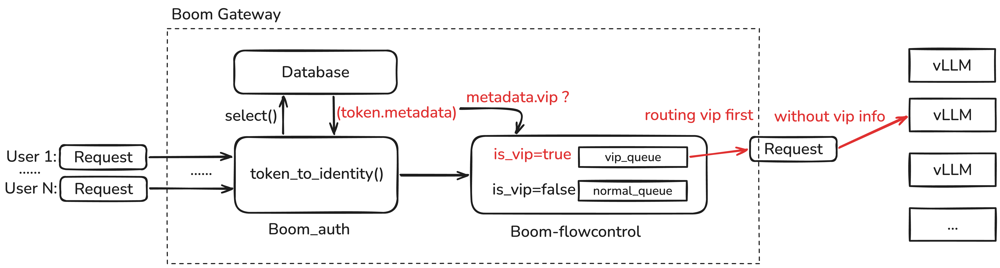
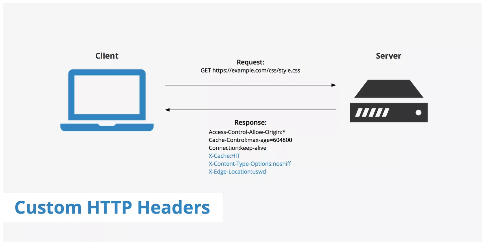

# VIP request 信息透传设计：`X-Gateway-Priority` Header

## 1. Background

### 1.1 问题陈述

在 BoomGateway 与 vLLM 之间加入任意其他中间件模块后，中间件需要感知每个请求的 VIP 状态以实现优先调度。然而请求离开 BoomGateway 后，VIP 信息已经丢失，后续组件无法得到 VIP 信息。



### 1.2 BoomGateway 的 VIP 队列机制

BoomGateway 在 `boom-flowcontrol` 模块中为每个 deployment 维护两条队列：`vip_queue` 和 `normal_queue`。调度时始终优先分发 `vip_queue` 中的请求。

**请求进入哪个队列的判定调用栈：**

``` c
HTTP POST /v1/chat/completions
  -> RequiredAuth::from_request_parts          [boom-main/src/extractor.rs]
       -> DbAuthenticator::authenticate        [boom-auth/src/key_auth.rs]
            -> token_to_identity()
                 -> AuthIdentity { metadata: token.metadata }
                        - lookup_token() 函数 从 boom_verification_token 表读取 metadata JSONB

  -> chat_completions_inner()                  [boom-main/src/routes.rs]
       -> acquire_fc_guard(
              is_vip_key(&identity.metadata),  <- 读 API key 的 metadata.vip 字段
            )
            -> FlowController::acquire(is_vip) [boom-flowcontrol/src/lib.rs]
                 -> is_vip=true  -> push_back(vip_queue)
                 -> is_vip=false -> push_back(normal_queue)
```

**Attention: `is_vip_key` 函数** （`boom-main/src/routes.rs`）：

VIP 状态存储在数据库 `boom_verification_token.metadata` 字段（JSONB），由 Dashboard 的 `update_key()` 接口写入 `{ "vip": true }`。

### 1.3 VIP 信息追踪

``` c
1. 认证阶段（VIP 信息产生）
   boom-main/src/extractor.rs: RequiredAuth::from_request_parts
     -> boom-auth/src/key_auth.rs: DbAuthenticator::authenticate
          -> token_to_identity() -> AuthIdentity { metadata.vip }

2. Flow Control 阶段（VIP 信息被使用，仅用于网关内部队列）
   boom-main/src/routes.rs: chat_completions_inner
     -> is_vip_key(&identity.metadata) -> bool
     -> acquire_fc_guard -> FlowController::acquire(is_vip)
          -> is_vip ? vip_queue : normal_queue

3. 转发阶段（VIP 信息丢失）
   boom-main/src/routes.rs: provider.chat_stream(req)  <- req 里无 vip
     -> boom-provider/src/openai.rs: OpenAIProvider::build_request
          -> serde_json::to_value(&req)  <- extra.skip_serializing
     -> POST to vLLM           <- 标准 OpenAI body，无 VIP info
```

---

## 2. High-Level Design

### 2.1 设计决策：写入 HTTP Header（默认关闭）

**核心决策：新增配置开关 `router_settings.enable_priority_header`（默认 `false`）。**
开关关闭时不注入任何额外 header，普通部署流程完全不受影响；只有显式开启（部署下游调度器时）才会注入 `X-Gateway-Priority`。

开关开启后，BoomGateway 在转发请求给下游调度器时，将优先级注入自定义 HTTP Header：

``` c
X-Gateway-Priority: 100    （VIP 请求）
X-Gateway-Priority: 0      （普通请求）
```

例子：https://www.keycdn.com/support/custom-http-headers 



下游调度器读取该 header 进行优先调度，转发给 vLLM 前将其移除。

**为什么用数值而不是字符串？** 数值（`0`~`100`）比 `"vip"` / `"normal"` 更具扩展性，下游调度器可以直接按数值大小排优先队列，未来新增中间层级无需修改协议。

**选型理由（对比其他方案）：**

| 方案 | 说明 | 结论 |
|------|------|------|
| **HTTP Header（本方案）** | 优先级经 `ChatCompletionRequest.gateway_headers`（`#[serde(skip)]`，不进 body）传到 provider 层，注入 `X-Gateway-Priority`，下游调度器读取后 strip | 推荐 |
| 下游调度器自查 DB | 下游调度器查 `boom_verification_token` | 不可行：BoomGateway 转发时用 provider key，原始用户 key 已被消费 |
| 在 JSON body 里加可序列化字段 | 给 `ChatCompletionRequest` 加普通字段并随 body 发出 | 污染 OpenAI 接口语义（本方案用 `#[serde(skip)]` 规避，字段不进 body） |
| 改 Provider trait 签名传 ctx | `chat(req, ctx)` 透传优先级 | 绑架核心接口，4 个无关 provider 被迫改签名 |

### 2.2 对现有 vLLM 服务的影响

**部署侧只改一个配置项 `enable_priority_header`，不动任何 vLLM 服务。**
默认关闭，存量部署零影响；灰度时只需在网关配置里把它置为 `true`。

即使开启后 `X-Gateway-Priority` 透传给 vLLM 也无影响——HTTP 协议规范允许自定义 header（`X-` 前缀），收到未知 header 会自动忽略。vLLM 基于 FastAPI 实现，对该 header：

- **不会拒绝请求**
- **不会返回错误**
- **不会影响推理结果**
- 仅在 server 日志中可能记录该 header（无害）

因此，**大模型服务完全不受影响**。


### 2.3 请求流转 curl 示例

请求经过两段链路，header 完全不同：

**第一段：客户端 -> 网关**（用户手动发起，携带用户自己的 API key）

> `-H` 设置 HTTP Header，`-d` 设置请求 body（JSON 内容）。

```bash
curl -X POST http://gateway.example.com/v1/chat/completions \
  -H "Authorization: Bearer sk-your-user-key" \
  -H "Content-Type: application/json" \
  -d '{
    "model": "Minimax-M2.7",
    "messages": [{"role": "user", "content": "give me 10 emoji"}],
    "stream": true
  }'
```

等效的原始 HTTP 报文：

```http
POST /v1/chat/completions HTTP/1.1
Host: gateway.example.com
Authorization: Bearer sk-your-user-key
Content-Type: application/json

{"model":"Minimax-M2.7","messages":[{"role":"user","content":"give me 10 emoji"}],"stream":true}
```

> 这一段 **没有** `X-Gateway-Priority`，网关尚未介入。

**第二段：网关 -> 下游调度器 / vLLM**（网关内部自动构造，对用户不可见）

```bash
# 以下是网关内部等效发出的请求（用户不会手动执行）
curl -X POST http://scheduler.router:30080/v1/chat/completions \
  -H "Authorization: Bearer sk-provider-key" \
  -H "Content-Type: application/json" \
  -H "X-Gateway-Priority: 100" \
  -d '{
    "model": "actual-model-id",
    "messages": [{"role": "user", "content": "give me 10 emoji"}],
    "stream": true
  }'
```

等效的 HTTP 报文：

```http
POST /v1/chat/completions HTTP/1.1
Host: scheduler.router:30080
Authorization: Bearer sk-provider-key
Content-Type: application/json
X-Gateway-Priority: 100

{"model":"actual-model-id","messages":[{"role":"user","content":"give me 10 emoji"}],"stream":true}
```

> - `Authorization` 变成了 **provider 侧的 key**（YAML 配置里的 `api_key`），用户的 key 在认证层已被消费。
> - `X-Gateway-Priority: 100` 是 **本次新增的**，只出现在这段链路。
> - `model` 被替换为 provider 侧的实际模型 ID。

**直连测试**：对网关发送第一段的 curl 命令，如果 key 在 DB 中标记为 VIP（`metadata.vip = true`），网关转发时就会自动带上 `X-Gateway-Priority: 100`。可在下游调度器或 vLLM 的访问日志中确认。

### 2.4 HTTP Header 容量与格式说明

HTTP Header 是纯文本的 key-value 对，每行一个。value 是 ASCII 字符串（数字、字母、标点均可），**不是 JSON**。一个实际发出的请求示例：

```http
POST /v1/chat/completions HTTP/1.1
Host: http://192.168.0.79:30080
Authorization: Bearer sk-provider-xxx
Content-Type: application/json
X-Gateway-Priority: 100

{"model":"Minimax-M2.7","messages":[...]}
```

**容量限制：**

| 维度 | 典型上限 |
|------|---------|
| 单个 header value | 4KB ~ 8KB（nginx 默认 4KB/行） |
| 所有 header 总和 | 8KB ~ 16KB（取决于 server 配置） |
| vLLM (uvicorn) | 约 8KB 总 header |

`X-Gateway-Priority: 100` 仅约 **25 字节**，即使未来扩展多个自定义 header（如 `X-Gateway-Team-Id`、`X-Gateway-Request-Id` 等）也远不会触及限制。

### 2.5 Extensibility（可扩展性）

当前实现使用数值优先级（`0` = 普通，`100` = VIP），预留了细粒度扩展空间：

**优先级层级扩展：**


| 级别 | 数值 | 场景 |
|------|------|------|
| 普通 | 0 | 默认请求 |
| 中优 | 30 | 白银会员用户（未来） |
| 高优 | 50 | 黄金会员用户（未来） |
| 紧急 | 70 | 钻石会员用户（未来） |
| VIP | 100 | 王者会员用户 |

**当前阶段**：优先级与 `metadata.vip`（boolean）绑定，`true` -> 100，`false` / 缺失 -> 0。

**未来扩展**：在 `metadata` JSONB 中新增 `priority` 数值字段（0~100），网关直接读取并透传，admin 通过 Dashboard 为每个 key 设置任意优先级数值。代码只需将 `is_vip_key()` 替换为 `extract_priority()`，向后兼容老数据（`vip: true` 视为 100）：

```rust
fn extract_priority(metadata: &serde_json::Value) -> u32 {
    if let Some(p) = metadata.get("priority").and_then(|v| v.as_u64()) {
        return (p as u32).min(100);
    }
    if metadata.get("vip").and_then(|v| v.as_bool()).unwrap_or(false) {
        return 100;
    }
    0
}
```

此后新增层级只需在 Dashboard 设置数字，**无需修改网关代码或 header 协议**。下游调度器按数值大小排序调度即可。

**Header 命名空间扩展：**

`X-Gateway-*` 作为 BoomGateway 的 header 前缀，未来可透传更多网关内部元数据给中间调度层：

```
X-Gateway-Priority: 100          <- 优先级（已实现）
X-Gateway-Team-Id: team_abc      <- 团队标识（未来，用于团队级调度）
X-Gateway-Request-Id: req_xxx    <- 请求追踪（未来，用于端到端链路追踪）
X-Gateway-Model-Hint: Minimax-M2.7 <- 模型提示（未来，用于语义感知模型）
```

这些 header 对不认识它们的 vLLM 实例 **完全无影响**（HTTP 协议规定未知 header 应忽略），因此可以随需增加，无兼容性风险。

---

## 3. Low-Level Design

### 3.1 核心思路

网关内部元数据（优先级）**搭载在请求结构体上**，而不是塞进 `Provider` trait 签名。
具体做法：给 `ChatCompletionRequest` 加一个 `#[serde(skip)]` 的 `gateway_headers` 字段，
作为从路由层到 provider 层的内存旁路通道。是否注入由配置开关控制，默认关闭。

这样有两个好处：
- `Provider` trait 签名不变，4 个不相关的 provider（Anthropic/Azure/Bedrock/Gemini）零改动。
- 默认不注入任何 header，只有显式开启时才注入，普通部署流程不受污染。

### 3.2 改动文件

| 文件 | 改动 |
|------|------|
| `boom-core/src/types.rs` | `ChatCompletionRequest` 新增 `#[serde(skip)] gateway_headers: HashMap<String,String>` 字段 |
| `boom-config/src/lib.rs` | `RouterSettings` 新增开关 `enable_priority_header: bool`（`#[serde(default)]`，默认 `false`） |
| `boom-main/src/routes.rs` | 新增 `build_gateway_headers()`，按开关填充 `req.gateway_headers` |
| `boom-provider/src/openai.rs` | 读取 `gateway_headers` 注入到发往上游的 HTTP 请求 |
| `Provider` trait + 其余 4 个 provider | **不变** |

### 3.3 关键代码

**1. 字段定义（`types.rs`）** —— `#[serde(skip)]` 保证它既不会从客户端 body 解析（防伪造），也不会序列化进上游 body。

```rust
pub struct ChatCompletionRequest {
    // ... 原有字段不变 ...
    #[serde(skip)]
    pub gateway_headers: HashMap<String, String>,
}
```

**2. 配置开关（`config/lib.rs`）**

```rust
pub struct RouterSettings {
    // ...
    #[serde(default)]
    pub enable_priority_header: bool,
}
```

**3. 按开关填充（`routes.rs`）** —— 开关关闭时返回空 map，不注入任何 header。

```rust
fn build_gateway_headers(is_vip: bool, enable_priority_header: bool) -> HashMap<String, String> {
    let mut headers = HashMap::new();
    if enable_priority_header {
        let priority = if is_vip { 100 } else { 0 };
        headers.insert("X-Gateway-Priority".to_string(), priority.to_string());
    }
    headers
}

// handler 中：
req.gateway_headers = build_gateway_headers(is_vip, inner.config.router_settings.enable_priority_header);
```

**4. provider 注入（`openai.rs`）** —— 序列化前把 headers 取出，逐条加到 HTTP 请求上。

```rust
let gateway_headers = std::mem::take(&mut req.gateway_headers);
// ... 构造 builder ...
for (name, value) in &gateway_headers {
    builder = builder.header(name, value);
}
```

### 3.4 数据流

```
routes.rs            : 读 metadata.vip -> build_gateway_headers(开关) -> 写入 req.gateway_headers
  | (内存传递，不进 JSON body)
openai.rs            : mem::take(gateway_headers) -> 逐条 .header(k, v)
  | (HTTP 请求头)
下游调度器           : 读 X-Gateway-Priority 调度 -> strip -> 转发给 vLLM
```

### 3.5 改动影响范围

| 模块 | 改动类型 | 风险 |
|------|---------|------|
| `boom-core` | `ChatCompletionRequest` 加一个 `#[serde(skip)]` 字段 | 低，不影响序列化 |
| `boom-config` | `RouterSettings` 加一个布尔开关 | 低，默认 `false` 向后兼容 |
| `boom-main` | routes.rs 加 helper + 填充（开关控制） | 低 |
| `boom-provider` | 仅 `openai.rs` 读取并注入；其余 4 个 provider **不变** | 低 |
| `Provider` trait | **不变** | 无 |

---

## 4. 验证方案

### 4.1 单元测试（已完成，全部通过）

| 模块 | 测试文件 | 覆盖内容 |
|------|---------|---------|
| `boom-provider` | `openai.rs` | 开关开启时 VIP=`100` / 普通=`0` / 自定义值 / streaming 注入 / 与 Authorization 共存；**`gateway_headers` 为空时确认不发任何 `X-Gateway-Priority`** |
| `boom-main` | `routes.rs` | `is_vip_key` 边界判定；`build_gateway_headers` 的 4 种组合（开关×VIP/普通），关闭时返回空 map |

`boom-provider` 的测试用 `wiremock` mock HTTP server，断言实际发出的请求头与预期一致（含「不该有该 header」的缺失断言）。

### 4.2 集成验证

用 `tcpdump` / `wireshark` 抓网关 -> 下游调度器流量，确认开关开启时 `X-Gateway-Priority` 存在且值正确，关闭时不存在。
